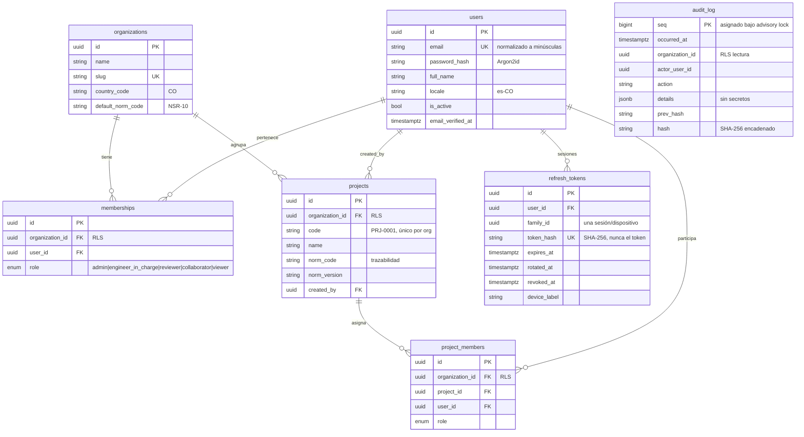

# Modelo de datos

Convenciones: PK UUID v7 (ordenable por tiempo), `created_at` / `updated_at`,
`deleted_at` (borrado lógico) en entidades de negocio, FK explícitas, nombres de
restricciones deterministas, RLS en tablas de tenant.

## Fase 0 (implementado)

### Índices justificados

| Índice | Motivo |
|---|---|
| `uq_users_email` | Login por correo |
| `ix_*_organization_id` | Filtro de RLS en todas las consultas de tenant |
| `uq_projects_organization_id (org, code)` | Código de proyecto único por organización |
| `ix_refresh_tokens_user_family` | Revocar una sesión / listar dispositivos |
| `uq_refresh_tokens_token_hash` | Canje de refresh token en O(log n) |
| `ix_audit_log_organization_id` | Feed de actividad por organización |

### Garantías en base de datos

- `audit_log`: UPDATE/DELETE/TRUNCATE bloqueados por trigger; `civia_app` solo puede
  leer (bajo RLS) y escribir mediante `audit_write()` (SECURITY DEFINER).
  `audit_log_verify()` detecta filas alteradas por cualquier vía.
- RLS `FORCE` en `projects`, `project_members`, `memberships`, `organizations`.

## Fases siguientes (diseño)

`files`, `file_versions`, `plans`, `plan_pages`, `detected_elements`, `element_properties`,
`inconsistencies`, `analysis_runs`, `calculations`, `calculation_inputs`, `calculation_results`,
`load_cases`, `load_combinations`, `materials`, `norms`, `norm_versions`, `norm_sections`,
`knowledge_documents`, `knowledge_chunks (embedding vector)`, `chat_sessions`, `chat_messages`,
`measurements`, `evidence_photos`, `observations`, `reports`, `model_3d`.

Todas las tablas de negocio llevarán `organization_id` + RLS. `analysis_runs` guarda versión
de norma, entradas, versión del plano, método y usuario (trazabilidad obligatoria).
Los roles se modelan como enum en Fase 0 (ADR 0005); una tabla `roles` con permisos
configurables se evaluará cuando haya roles personalizados por organización.

## Migraciones y backups

- Alembic (`services/api/alembic`), ejecutadas con el rol propietario
  (`MIGRATIONS_DATABASE_URL`); la API nunca usa ese rol.
- Cada migración tiene `downgrade`. Se prueban en CI aplicándolas a una BD vacía.
- Backups cifrados diarios + WAL continuo; prueba de restauración mensual
  (RPO 15 min / RTO 4 h como objetivo inicial; ver guía de despliegue).
